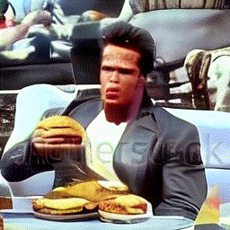

# sd-video

Text to Video


## Example
```py
from sd_video import SDVideo, save_gif
model = SDVideo('/path/to/model_and_config', 'cuda')
x = model('arnold schwarzenegger eating a giant cheeseburger')
save_gif(x, 'output.gif')
```




## Sampling options
```py
model(
  text = 'some text', # text conditioning
  text_neg = 'other text' # negative text conditioning
  guidance_scale = 9.0, # positive / negative conditioning ratio (cfg)
  timesteps = 50, # sampling steps
  image_size = (256, 256), # output image resolution (w,h)
  num_frames = 16, # number of video frames to generate
  eta = 0.0, # DDIM randomness
  bar = False, # display TQDM progress bar for sampling process
)
```

## Model options
```
model = SDVideo(
  model_path = 'path/to/model', # path to model and configuration.json
  device = 'cuda', # device (string or torch.device)
  dtype = torch.float32, # load model in precision (only float types, float32, float16, bfloat16)
  amp = True # sample with automatic mixed preicision
)
```
  
  
