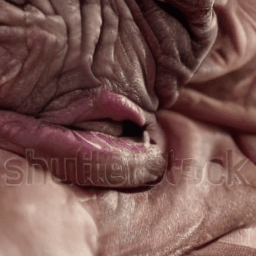

# sd-video

Text to Video


## Example

### Text 2 Video
```py
from sd_video import SDVideo, save_gif
model = SDVideo('/path/to/model_and_config', 'cuda')
# if installed, use xformers for a small performance boost
model.enable_xformers(True)
x = model('arnold schwarzenegger eating a giant cheeseburger')
save_gif(x, 'output.gif')
```


### Video 2 Video
```py
  denoise_strength = 0.7
  timesteps = 50
  model = SDVideo('/path/to/model_and_config', 'cuda')
  init_frames = load_sequence('path/to/image_sequence')
  x = model(
          'very wrinkly and old',
          initial_frames = init_frames,
          bar = True,
          timesteps = timesteps,
          t_start = round(timesteps * denoise_strength)
  )
  save_gif(x, 'output.gif')
```





## Sampling options
```py
model(
  text = 'some text', # text conditioning
  text_neg = 'other text' # negative text conditioning
  guidance_scale = 9.0, # positive / negative conditioning ratio (cfg)
  timesteps = 50, # sampling steps
  image_size = (256, 256), # output image resolution (w,h)
  num_frames = 16, # number of video frames to generate
  eta = 0.0, # DDIM randomness
  bar = False, # display TQDM progress bar for sampling process
)
```

## Model options
```
model = SDVideo(
  model_path = 'path/to/model', # path to model and configuration.json
  device = 'cuda', # device (string or torch.device)
  dtype = torch.float32, # load model in precision (only float types, float32, float16, bfloat16)
  amp = True # sample with automatic mixed preicision
)
```

## Model weights
- From Huggingface
  - https://huggingface.co/damo-vilab/modelscope-damo-text-to-video-synthesis
  - last version released under Apache 2.0 (later are CC-BY-NC-ND-4.0): https://huggingface.co/damo-vilab/modelscope-damo-text-to-video-synthesis/tree/6961f660ba8d22f98da33829c73c7da5d205518e
- From Modelscope
  - https://modelscope.cn/models/damo/text-to-video-synthesis/files (v1.0.4 as released under Apache 2.0, later versions are released under CC-BY-NC-ND-4.0)


## Acknowledgements

Partly based on the following works
  - https://github.com/openai/guided-diffusion (licensed MIT)
  - https://github.com/CompVis/stable-diffusion (licensed MIT)
  - https://github.com/modelscope/modelscope/blob/master/modelscope/pipelines/multi_modal/text_to_video_synthesis_pipeline.py (licensed Apache 2.0 at the time of copy)
  - https://github.com/modelscope/modelscope/tree/master/modelscope/models/multi_modal/video_synthesis (licensed Apache 2.0 at the time of copy)

All other code is released under the Affero GNU Public License v3 (AGPLv3).
